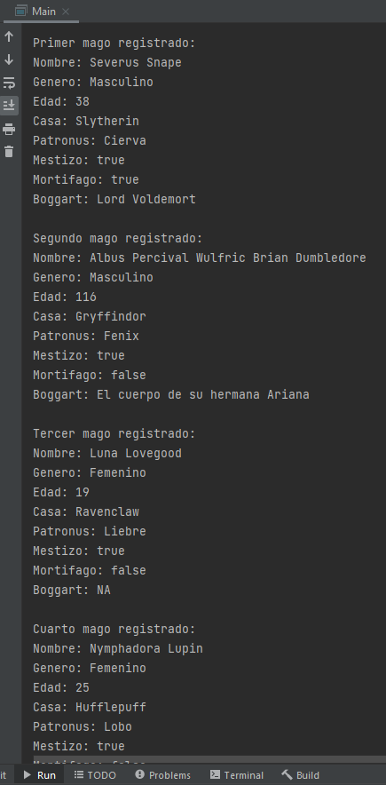
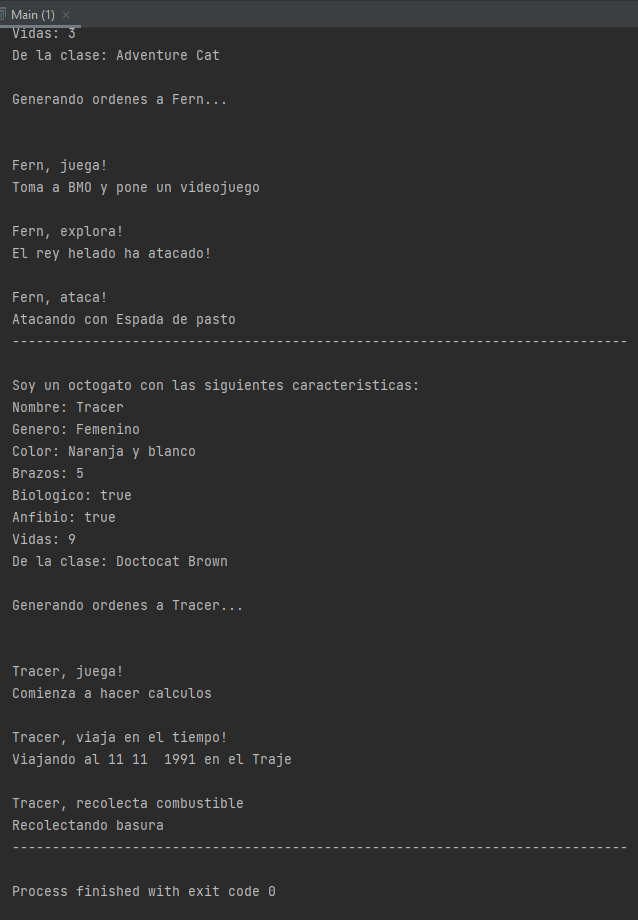
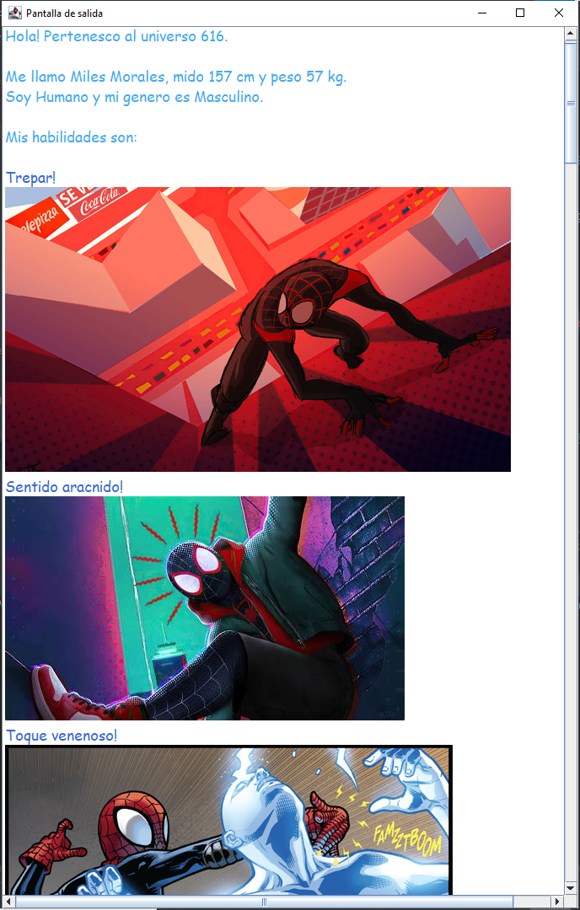
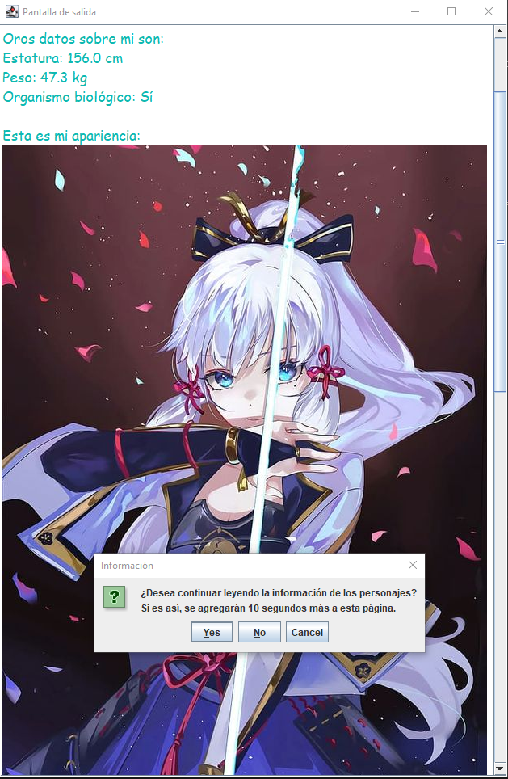

# Backend Java

Prácticas correspondientes al curso de Fullstack LaunchX.

## Práctica 1: Modelado

Modelado de 5 personajes de la saga Harry Potter.

 - Mago:
    - Nombre (cadena)    
    - Género (cadena)
    - Edad (entero)
    - Casa (cadena)
    - Patronus (cadena)
    - Mestizo (boleano)
    - Mortífago (boleano)
    - Boggart (cadena)

 - Método de esta clase: ```showMessage()```

Programa ejecutado:



## Práctica 2: Herencia y polimorfismo

Tomando como padre a octogato se derivan las siguientes tres clases:


                ╔═> Adventure Cat
                ║
    - Octogato ═╬═> Doctocat Brown
                ║
                ╚═> Grim Repo

Las características de la clase padre son:

 - Octogato:
    - Nombre
    - Género
    - Color
    - Vidas
    - Brazos
    - Anfibio
    - Biológico

Note que la abstracción de las características representativas corresponden a las características de un gato y un pulpo, características como el número de vidas, en el caso de ser un gato (siguiendo la creencia popular) y el número de brazos, ya que es parte pulpo. Como Mona es un personaje ficticio e híbrido, se le dio la caractrística de ser anfibio, aunque esta no sea del todo acertada. La característica de biológico se le dio ya que puede no serlo.

Ya que puede haber una gran variedad de octogatos, se sobrecargó el constructor para así crear su octogato preferido.

Esta clase tiene dos métodos, ```showMessage()```, que muestra las características del octogato creado y ```play()```, que muestra cómo juega un octogato base.

En el caso de un octogato Grim Repo, al crearlo, se establecen varias características que son permanentes, como el número de vidas que posee (cero) y el ser clasificado como biológico (falso). Sus acciones incluyen ```transicionar()``` una vida y ```observar()``` cuánta vida le queda a alquien. 

Cada octogato hijo cambia la forma base de juego de octogato (Overrride).

Programa ejecutado:



## Práctica 3: Interfaces

La clase Spider man es la clase padre, de ahí, se derivan tres clases hijas:

                  ╔═> Miles Morales
                  ║
    - Spider man ═╬═> Gwen Stacy
                  ║
                  ╚═> Miguel O'Hara

La clase padre tiene las siguiente abstracción del personaje Spider man. Note que las características parecen ser no tan representativas, incluso, podrían confundir con las características de cualquier persona. Sin embargo, esto se debe a las características del multiverso, prácticamente cualquiera puede ser Spider man, además, justo este mensaje dieron los creadores: cualquiera puede usar la máscara si se lo propone. 

Quitando estos hechos de lado, la única característica que se puede resaltar, es el universo al que pertenecen.

 - Clase:
    - Nombre
    - Genero
    - Animalia (Ya que puede no ser humano)
    - Altura
    - Peso
    - Universo

Dentro de esta clase es posible llamar dos métodos: el método ```showStatus()```, el cual retorna una cadena con una presentacion del personaje. El segundo método dentro de esta clase puede ser llamado mediante ```initInter(<tipo screen>)``` para iniciar una interfaz gráfica y darle formato a la cadena de la presentacion con un tamaño, estilo y color personalizado a las letras.

La interfaz para cada personaje hijo cambia debido a sus habilidades particulares. En el Caso de Gwen Stacy su interfaz se describe como:

- Interfaz:
    - Escala muros
    - Sentido Aracnido
    - Piel Roca
    - Equilibrio

Esta práctica se realizó mediante interfaces y el uso de la biblioteca `inmosh`, proporcionada por la MC Fernanda Ochoa. El programa muestra las habilidades y características de cada personaje en una ventana emergente, mediante la implementación de sus interfaces.

Programa ejecutado:



## Práctica 4: Hilos

En esta práctica se crearon dos clases principales: La clase Comic y la clase Personaje. La clase Comic representa las funciones e información que un comic puede tener, mientras que la clase Personaje almacena las características de los personajes involucrados en la historia.

 - Comic
    - Empresa
    - Serie
    - Genero
    - Numero
    - Día
    - Mes
    - Año

- Método de esta clase: ```showFetures()```

- Interfaz de Comic:
    - Inicio: Muestra el contexto de la historia.
    - Presentación: Dimensiona la ventana para mostrar la información de los personajes involucrados.
    - Secuencia: Dimensiona la ventana para mostrar las viñetas de forma adecuada del comic.
    - Cuadro: Limpia la viñeta, da formato al texto y establece el tiempo de exposición.
    - Pausa: Pausa simple.

La implementación de la interfaz de comic, se llamó CGenshin. Para otros comics, puede llamar a su implementación como CNombre, aunque eso está a su criterio.

Debido al gran espectro de un personaje dentro de un comic, la clase padre tiene características básicas, por lo que de esta clase se deriva la clase Teyvatian, que agrega características al personaje, propias del universo de la historia.

- Teyvatian
    - Derivadas de la clase Personaje:
        - Nombre
        - Raza
        - Género
        - Biológico
    - Especificas para Teyvat:
        - Elemento
        - Edad
        - Estatura
        - Peso
        - Pais
- Método de esta clase ```showFeaturesPT(<tipo string>,<tipo boleano>)```

La interfaz de la clase personaje solo consiste en la presentación. En su implementación es posible modificar la fuente del mensaje y la imagen de su apariencia.

En resumen. El comic comienza con una presentación del mismo dando un poco de contexto, después se muesta información de los personajes involucrados y pregunta si el usuario necesita más tiempo para visualizar la información del personaje. Una vez terminada esta fase, comienza la narración de la historia.

Dependiendo del presentador, las dos primeras partes pueden ser omitidas para entrar a la historia desde un principio.

El diagrama de la implementación de la interfaz de Comic se puede ver de la siguiente forma clases se puede visualizar así:

                      ╔═> Comic Genshin
                      ║
    - ComicCallbacks ═╬═> Comic Ejemplo 2
                      :
                      ╚═> Comic Ejemplo n

En el caso de la clase Personaje, su diagrama corresponde a:

                 ╔═> Teyvatian
                 ║
    - Personaje ═╬═> Personaje contexto 2
                 :
                 ╚═> Personaje contexto n

Programa ejecutado:

